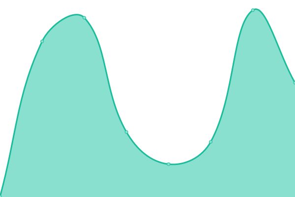

# [📈 Live Status](https://smallquery.github.io): <!--live status--> **🟧 Partial outage**

This repository contains the open-source uptime monitor and status page for [smallquery](https://smallquery.github.io), powered by [Upptime](https://github.com/upptime/upptime).

With [Upptime](https://upptime.js.org), you can get your own unlimited and free uptime monitor and status page, powered entirely by a GitHub repository. We use [Issues](https://github.com/smallquery/uptime/issues) as incident reports, [Actions](https://github.com/smallquery/uptime/actions) as uptime monitors, and [Pages](https://smallquery.github.io) for the status page.

<!--start: status pages-->
<!-- This summary is generated by Upptime (https://github.com/upptime/upptime) -->
<!-- Do not edit this manually, your changes will be overwritten -->
<!-- prettier-ignore -->
| URL | Status | History | Response Time | Uptime |
| --- | ------ | ------- | ------------- | ------ |
|  [Tezos.com](https://tezos.com) | 🟩 Up | [tezos-com.yml](https://github.com/smallquery/uptime/commits/HEAD/history/tezos-com.yml) | 

 189ms
     
 | 

<a href="https://smallquery.github.io/uptime/history/tezos-com">100.00%</a>
    

|  [Tezos Commons Website](https://tezoscommons.org) | 🟩 Up | [tezos-commons-website.yml](https://github.com/smallquery/uptime/commits/HEAD/history/tezos-commons-website.yml) | 

 302ms
     
 | 

<a href="https://smallquery.github.io/uptime/history/tezos-commons-website">100.00%</a>
    

|  [Tezos Agora Frontend](https://tezosagora.org) | 🟩 Up | [tezos-agora-frontend.yml](https://github.com/smallquery/uptime/commits/HEAD/history/tezos-agora-frontend.yml) | 

 648ms
     
 | 

<a href="https://smallquery.github.io/uptime/history/tezos-agora-frontend">100.00%</a>
    

|  [Tezos Agora Backend](https://forum.tezosagora.org) | 🟥 Down | [tezos-agora-backend.yml](https://github.com/smallquery/uptime/commits/HEAD/history/tezos-agora-backend.yml) | 

 348ms
     
 | 

<a href="https://smallquery.github.io/uptime/history/tezos-agora-backend">100.00%</a>
    

|  [TzKt.io](https://tzkt.io) | 🟩 Up | [tz-kt-io.yml](https://github.com/smallquery/uptime/commits/HEAD/history/tz-kt-io.yml) | 

 686ms
     
 | 

<a href="https://smallquery.github.io/uptime/history/tz-kt-io">100.00%</a>
    

<!--end: status pages-->

[**Visit our status website →**](https://smallquery.github.io)

## 📄 License

- Powered by: [Upptime](https://github.com/upptime/upptime)
- Code: [MIT](./LICENSE) © [smallquery](https://smallquery.github.io)
- Data in the `./history` directory: [Open Database License](https://opendatacommons.org/licenses/odbl/1-0/)
